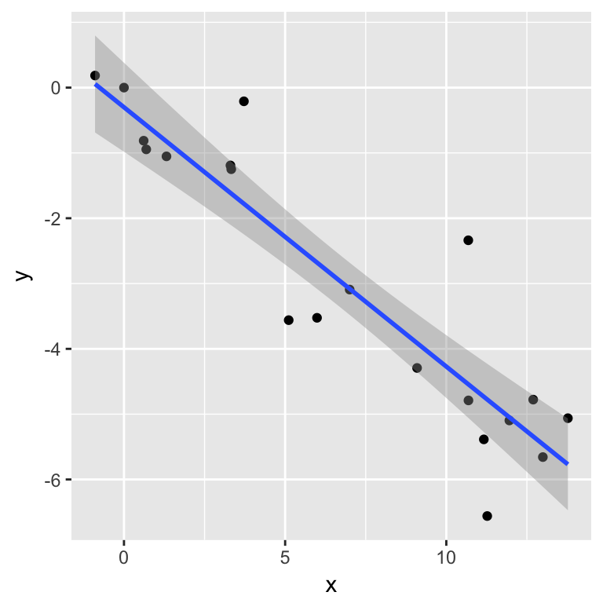
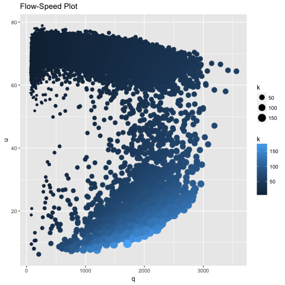
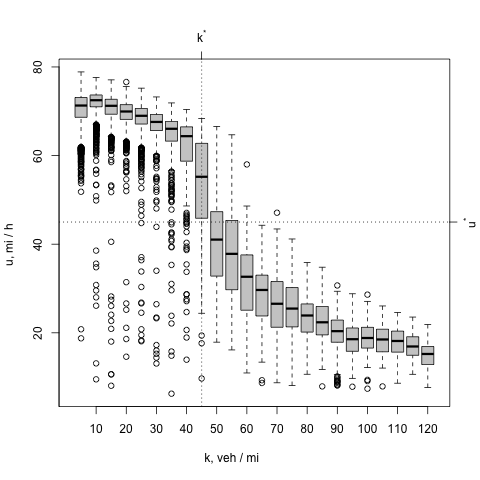
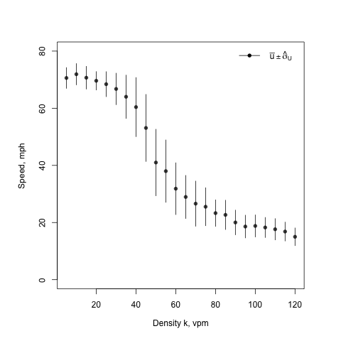
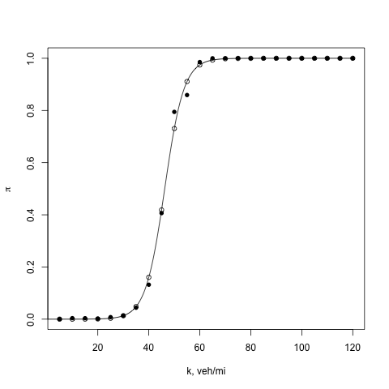
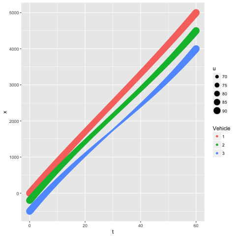
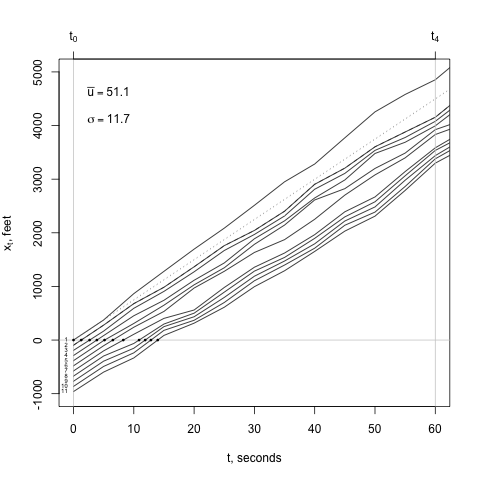
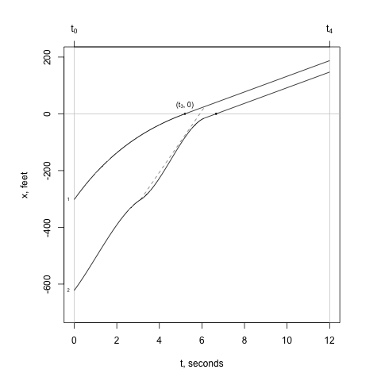

```{r setup, include=FALSE}
knitr::opts_chunk$set(echo = TRUE)
```

## R Markdown

This is an R Markdown document. Markdown is a simple formatting syntax for authoring HTML, PDF, and MS Word documents. For more details on using R Markdown see <http://rmarkdown.rstudio.com>.

When you click the **Knit** button a document will be generated that includes both content as well as the output of any embedded R code chunks within the document. You can embed an R code chunk like this:

```{r cars}
summary(cars)
```

## Including Plots

You can also embed plots, for example:

```{r pressure, echo=FALSE, fig.height = 3, fig.width=3}
plot(pressure)
```

Note that the `echo = FALSE` parameter was added to the code chunk to prevent printing of the R code that generated the plot.


```{r, out.width = "200px", echo = FALSE}
knitr::include_graphics("png_images/tripdispersion-1.png")

```

```{r, out.width = "300px", echo = FALSE}

```


 

__speedplot.R__


An example of linking this site to a remote site. ![R Markdown Website]"https://www.rstudio.com/wp-content/uploads/2015/03/rmarkdown-reference.pdf" 

 

__speedboxplot.R__


 

__ukplot.R__

 

__logisticmodel.R__


 

__zipper.R__

 

__rrtrial.R__

 

__trial.R__.
